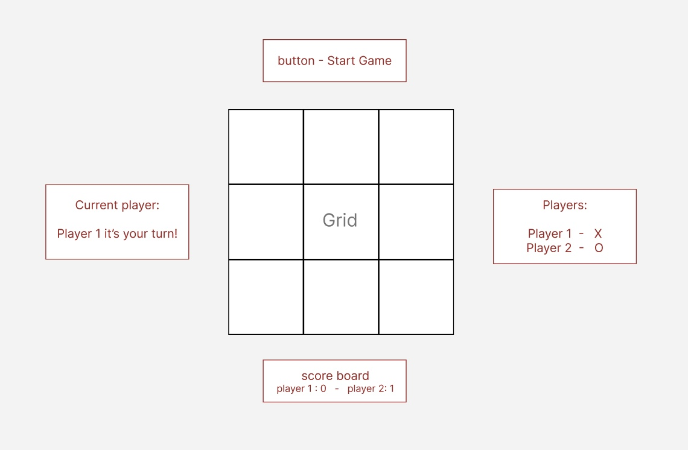

# Readme sections

gihub pages link - https://catherineloesch.github.io/project-1-tictactoe/

repo link - https://github.com/catherineloesch/project-1-tictactoe

1. List + explain technologies used and approach taken

2. Installation instructions

3. Unsolved problems

4. Link to wireframes and user stories.

5. Document your planning and tell a story about your development process and problem-solving strategy.

6. List unsolved problems which would be fixed in future iterations.

7. Describe how you solved for the winner

8. Describe how some of your favorite functions work

# summary / Description

- This is a game of tic tac toe, with score counter
  purpose, tooling, and development history
  Description
  What your project is / should be used for
  What problem(s) your projects solves

Brief Example
This could be a code snippet showing how your project should be used (if it is meant to be integrated into another app)
This could be a screenshot of your project running in the browser (if it is a stand-alone application)

A small code example¶Show a telling example of what your project would normally be used for

conver your specific experience and approach.

List of Features / User Stories
This typically will be a short list of the features / user stories that you planned during the development phase of the project
To provide more detail, you can show how you categorized these features into Bronze (MVP), Silver, and Gold Levels and indicate which features you complete / have yet to complete

# Deliverables

1. A working game hosted online

2. A link to hosted working game in the URL section of your Github repository

3. A git repository hosted on Github, with a link to your hosted game, and frequent commits dating back to the very beginning of the project

- Explanations of the technologies used, the approach taken, installation instructions, unsolved problems, etc.

## MVP/Bronze Plan - Minimum viable Product

- build a dynamic game that allows two players to compete ina game of Tic Tac Toe from the same computer

- - Include separate HTML / CSS / JavaScript files

- Render a game board in the browser

- Switch turns between X and O (or whichever markers you select)

- Visually display which side won if a player gets three in a row, or show a draw if neither player wins

- adhere to KISS + DRY principles

- Use JavaScript for DOM manipulation

- Deploy game online

- Use semantic markup for HTML and CSS

- well-formatted, and well-commented code

- HTML page with a table of 9 cells
  - Just enough Javascript to show you who the current player is and change the background color of a cell when you click on it.
  - Just enough CSS to make the cells visible.

## User Stories

- As a user, I should be able to start a new tic tac toe game

- As a user, I should be able to click on a square to add X first and then O, and so on

- As a user, I should be shown a message after each turn for if I win, lose, tie or who's turn it is next

- As a user, I should not be able to click the same square twice

- As a user, I should be shown a message when I win, lose or tie

- As a user, I should not be able to continue playing once I win, lose, or tie

- As a user, I should be able to play the game again without refreshing the page

  - as a user, I should be able to change the color of my X/O
  - as a user, I want to be able to enter my name and be shown my score and when it is my turn
  - as a user, I want to be able to mute the sound effects of the game

## Silver Plan

- Enough CSS to make it actually look like a game, and enough Javascript for a "reset" button.

## Gold Plan

- Keep track of multiple game rounds with a win, lose and tie counter

- Allow players to customize their tokens (X, O, name, picture, etc)

- Use localStorage to persist data locally to allow games to continue after page refresh or loss of internet connectivity

- Involve Audio in your game

- Create an AI opponent: teach JavaScript to play an unbeatable game against you

- Make your site fully responsive so that it is playable from a mobile phone

- Get inventive with your styling e.g. use hover effects or animations

- Allow 2 players to play online with each other using any means such as WebSockets, Firebase, or other 3rd-party services.

- play against computer

- Gold: CSS transitions or animations, showing "X" and "O" instead of colors, and Javascript that tells you when the game is over and who won.

## Planning

- MVP wireframe



## technologies used

This typically would consist of all primary languages, frameworks, and libraries your app is composed of

- This Game was writtin with vanilla JavaScript, HTML 5 and CSS (CSS Flexbox and Grid were used)
- figma for building the wireframe
- Visual Studio Code: used for coding with Html, CSS and JavaScript
- Google Chrome Web Browser: used for launching the website For displaying the application

Google Chrome Developer Tools: For troubleshooting and debugging

Git/GitHub and Github pages(deployment)

external resources

- icons: svg (scalable vector graphics) from iconify (open source vector icon library)
  - https://iconify.design/
- google fonts
  - https://fonts.google.com/specimen/Comfortaa
- js confetti
  - https://www.npmjs.com/package/js-confetti
  - JavaScript Confetti library
- TimelineMax gsap for transition animations of layover and start button
  - https://cdnjs.com/libraries/gsap
  - JavaScript library for building animations
- opensource mp3 sound files

  - https://pixabay.com/sound-effects/

- https://howlerjs.com/
  https://cdnjs.com/libraries/howler

## Installation

Installation Instructions / Getting Started
This section should walk a reader, step by step, through the process of setting up your project
For a tool meant to be integrated into other projects, this would likely outline the process of installing and accessing this tool in your project
For an application, this would likely outline the process of forking, cloning, and starting the app locally

- no need
- just need a Web Browser with JavaScript Support and Internet Connectivity

##Approach

-> how winner is selected:
-> Figma for control flow

## Requirements met

Build a web application from scratch, must be your own work.

## MVP requirements

## Stretch Technical Goals

##methodology

- wireframe
- pseudocode
- basic html/css
- game logic in JS for MVP
- addition features: add name, overlay to display message, display whose turn it is

Good links to include are:
A link to the project's main repository
A link to the project's issue tracker

# Template

Project Title
One Paragraph of project description goes here

Getting Started
These instructions will get you a copy of the project up and running on your local machine for development and testing purposes. See deployment for notes on how to deploy the project on a live system.

Prerequisites
What things you need to install the software and how to install them

Give examples
Installing
A step by step series of examples that tell you how to get a development env running

Say what the step will be

Give the example
And repeat

until finished
End with an example of getting some data out of the system or using it for a little demo

Running the tests
Explain how to run the automated tests for this system

Break down into end to end tests
Explain what these tests test and why

Give an example
And coding style tests
Explain what these tests test and why

Give an example
Deployment
Add additional notes about how to deploy this on a live system

Built With
Dropwizard - The web framework used
Maven - Dependency Management
ROME - Used to generate RSS Feeds
Contributing
Please read CONTRIBUTING.md for details on our code of conduct, and the process for submitting pull requests to us.

Versioning
We use SemVer for versioning. For the versions available, see the tags on this repository.

Authors
Billie Thompson - Initial work - PurpleBooth
See also the list of contributors who participated in this project.

License
This project is licensed under the MIT License - see the LICENSE.md file for details

Acknowledgments
Hat tip to anyone whose code was used
Inspiration
etc

ISSUES

- mp3 files don't work on github pages : Failed to load resource: the server responded with a status of 404 ()
- removed audio folder from assets folder and put it in main project folder-> that solved the issue

```
function checkForWin(currentSymbol) {
    const result = winningCombinations.some((combo) => {
        return combo.every(index => {
            return Array.from(allCells)[index].classList.contains(currentSymbol) //need to turn html collection into array
        })
    })
    return result

}
´´´
```

function checkForWin(currentSymbol) { //checking grid to see if player won after making a move
const result = winningCombinations.some((combo) => { //for each possible winning combination (array of 3 indexes e.g. [0, 1, 2])
return combo.every(index => { //is there a match for EVERY single one of those 3 indexes
return Array.from(allCells)[index].classList.contains(currentSymbol) // in the array of all the cells that contain the current symbol??
}) //need to turn html collection into array with Array.from()
})
return result

}

describe how some of your favorite functions work

- [ ] What would you do differently?
- [ ] What are you most proud of?
- [ ] What would you do next?
- [ ] How did you plan your project?
- [ ] What did you learn?
