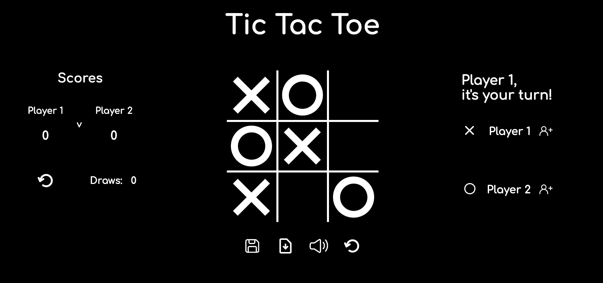

# Project 1 - Tic Tac Toe

## Overview

1. Description
2. Deployment Link
3. Installation
4. Technologies Used
5. Deliverables
6. Planning
7. Build Process
8. Challenges
9. Wins
10. Key Learnings & Takeaways
11. Future Improvements

---

# 1. Description

### **A game of Tic Tac Toe a.k.a. Naughts & Crosses built with HTML/CSS/JS.** <br>

The goal of this project was to create a web application from scratch as part of the curriculum for the General Assembly Software Engineering Immersive Course. With the objective of building a dynamic game that allows two players to compete from the same computer, I used HTML, CSS and JavaScript to create a version of the classic Tic Tac Toe game (a.k.a. Noughts&Crosses).
<br>

This version lets users enter their name and pick a colour for their symbol (X or O). After they press the button to start the game, a preview of their symbol will appear in any empty cell when they hover over it. They can make a move by clicking on an empty cell and their symbol will appear inside that cell before switching turns. A display on the screen lets the users know whose turn it is to make a move. They are also notified when one of them wins or if there's a draw. Users can reset the game by clearing the grid at any time. The application will also keep track of the number of draws and wins of each player, both of which can be reset as well. The game also features animations and sound effects, which can be muted. LocalStorage also gives users the option to continue their game where they left off after the page reloads or the internet connection is interrupted.
<br>



---

# 2. Deployment link

- The project is hosted online on GitHub pages: https://catherineloesch.github.io/project-1-tictactoe/

---

# 3. Installation

No installations are required to run this game. The only tools needed are a web browser with JavaScript support and internet connectivity.

---

# 4. Technologies Used

This game was written in vanilla JavaScript, HTML and CSS.

### Additional tools used:

- Figma: a design tool used for building the wireframe
- Visual Studio Code (VSCode): code editor used for writing HTML, CSS and JavaScript
  - Live Server: an extension that enables you to launch a local development server with live browser reload capability.
    - https://marketplace.visualstudio.com/items?itemName=ritwickdey.LiveServer
- Google Chrome Web Browser: used for launching the website and displaying the application
  - Google Chrome Developer Tools: For troubleshooting and debugging
- Git/GitHub (for version control) and Github pages(for deployment)
  <br>

### External web resources:

- icons
  - all icons used are Scalable Vector Graphics from iconify (open source svg library)
    - https://iconify.design/
- Google Fonts
  - Comfortaa, designed by Johan Aakerlund
    - https://fonts.google.com/specimen/Comfortaa
- Animation
  - JavaScript Confetti library
    - https://www.npmjs.com/package/js-confetti
  - TimelineMax/GSAP library for timing animations
    - https://cdnjs.com/libraries/gsap
    - https://greensock.com/docs/v2/TimelineMax
- Audio
  - all sound effects used are open-source .mp3 sound files from Pixabay
    - https://pixabay.com/sound-effects/
  - Howler audio library
    - https://howlerjs.com/
    - https://cdnjs.com/libraries/howler
    - https://github.com/goldfire/howler.js/

---

# 5. Deliverables

- A working game hosted online
- A git repository hosted on Github, including:
  - a link to the hosted game
  - frequent commits dating back to the very beginning of the project
- The Tic Tac Toe game should:
  - Render a game board in the browser
  - Switch turns between X and O (or whichever markers you select)
  - Visually display which side won if a player gets three in a row, or show a draw if neither player wins
  - include separate HTML / CSS / JavaScript files
  - adhere to KISS (Keep It Simple Stupid) and DRY (Don't Repeat Yourself) principles
  - use JavaScript for DOM manipulation
  - use semantic markup for HTML and CSS while adhering to best practices
  - write code that is well-formatted and well-commented

### Potential Extra Features

- keeping track of multiple game rounds including wins, losses and draws
- give players the option to customise their icons (e.g. X, O, name, picture)
- use localStorage to persist data locally
- include audio
- create an AI opponent
- fully responsive site
- inventive styling (e.g. hover effects, animations)
- give players option to play online with each other using any 3rd-party services

### User Stories

- As a user, I should be able to start a new Tic Tac Toe game.
- As a user, I should be able to click on a square to add X first and then O, and so on.
- As a user, I should be shown a message after each turn telling me if I win, lose, tie or whose turn it is next.
- As a user, I should not be able to continue playing once I win, lose, or tie
- As a user, I should not be able to click the same square twice.
- As a user, I should be able to play the game again without refreshing the page.

---

# 6. Planning

I started the planning process by makeing 3 different plans:

1. A bronze plan that fulfils all the requirements for the MVP.
2. A silver plan with additional features I would like to add to my project if time allows for it.
3. A gold plan with more features that my ideal project would contain, with the intention of implementing some of them if there's enough time.

## Bronze Plan: MVP (Minimum viable product)

- make a Tic Tac Toe game that works with the following features:
  - code that follows KISS/DRY principles
  - separate files for HTML, CSS and JavaScript
  - use semantic markup when writing HTML and CSS and use JavaScript for DOM manipulation
  - code has comments explaining logic and adequate formatting
  - program renders error-free in a browser and renders a 3x3 grid
    - use HTML+CSS to make sure cells are clearly visible
  - two players can compete from the same computer following traditional Tic Tac Toe rules
    - https://www.gamesver.com/all-about-tic-tac-toe-purpose-rules-how-to-play-strategy/
  - button that enables the user to start a game
  - when a player clicks a square, either an X or an O symbol will display depending on which player's turn it is
  - players can't click the same cell twice
  - automatically switch turns between 2 players (i.e. between X and O symbols)
  - lets players know whose turn it is
  - if a player has 3 symbols in a row, display a message announcing their win
  - after there's a win, a player can't click more squares
  - if all nine cells are marked and there's no win, display a message announcing a draw
  - button allowing players to to reset the game without refreshing the page
- host project on GitHub pages

## Silver Plan

- keep track of wins and losses
- display wins and losses on a score board
- enable users to reset scores
- enable users to enter their name and have it displayed instead of "Player 1" or "Player 2"
- make game look more polished with CSS features
- let users pick a colour for their symbol
- display a message telling players whose turn it is to play in the colour they selected
- add sounds effects
- add animation effects
- enable user to mute sound effects
- show player preview of their symbol when they hover over an empty cell

## Gold Plan

- enable users to choose their symbol (either X or O or additional icons)
- use localStorage to save game data locally and enable players to continue where they left off after the page refreshes or the internet connection is interrupted
- create an AI opponent
- make the web page fully responsive so that it can be used from a smartphone or smaller screen
- enable 2 players to play online with each other using a third party service (e.g.WebSockets or Firebase)

After lining out my bronze, silver and gold plans, I created a wireframe:

<br>

<br>

After completing the wireframe I wrote some pseudocode for my MVP to guide me while writing the JavaScript components:
<br>


## 7. Build Process

This was a solo project, with instructions and deliverables detailed on 29/03/2023 and a submission deadline to be met on 04/04/2023.

### Day1 - 29/03/2023

After I had my MVP/bronze plan, wireframe and pseudocode laid out, I took the first few steps toward building the project:

- I created a repository on GitHub for the project.
- I connected the gihub repository to a directory on my local machine.
- I created new HTML/CSS/JavaScript files in it.
- I connected the CSS and JavaScript files to the HTML file and made sure they work

After getting all those documents set up, I started writing some HTML for the game board, consisting of a `<div>` element that contains 9 more `<div>` elements, one for each cell of the grid. I used CSS grid to get the 3x3 format and removed the outer border:


As the font size and style can affect how letters are displayed on a website, I didn't want to use the letters 'X' and 'O' as symbols for the game, so I created the X and O symbols with CSS. I used the `::before` and `::after` pseudo-elements, which allow you to add content to a specific part of an element, in my case, each of the cells.

- https://css-tricks.com/almanac/selectors/a/after-and-before/


I created two different CSS classes, one called `'x'` and one called `'o'`. If the `'x'` class is added to a cell, it displays the X symbol, if a cell has the `'o'` class added to its classList, it displays an O. If neither 'x' nor 'o' are present, it is just an empty cell. I used a similar approach in combination with a different colour and the `:hover` selector to make the same symbol appear in the cell when the user hovers over it, giving them a 'preview'.


With the basic grid setup done, I tackled the JavaScript component. I started by using `.querySelectorAll()` to select all the cells I created using HTML and CSS and saved them to a variable. Since I had given each cell a CSS class of `.cell` I used the class selector to target them. Since I needed to find out when a user is clicking on a cell, I attached an eventListener to each cell. I then realised that by setting things up that way, the eventListener will fire up each time a user presses a cell, even if already has a symbol in it. Since a cell can't be selected more than once during each round of the game, the eventListener needs to be disabled after the first click.

After some online research I realised that there is a way to specify that an event is only handled once: the `once` property.

- https://www.educative.io/answers/how-to-ensure-an-event-listener-is-only-fired-once-in-javascript

If this property is set to `true`, the eventListener will only be triggered once:

```JavaScript
const allCells = document.querySelectorAll('.cell')

allCells.forEach((cell) => {
cell.addEventListener('click', handleUserInput,  {once: true})
})

```

I spent the rest of the first day writing the code that runs when one of those eventListeners is triggered, making sure the right CSS class is added to the cell that triggered the eventListener and having the right symbol appear on screen as a result of that. The parts that were still missing for the logic however were what happens after a player makes a move and their symbols shows up on the grid:

1. check if the player who made the move won the game
2. check if there's a draw
3. if neither 1. nor 2. are ture, the game continues in which case the players are switching turns.

### Day2 - 30/03/2023

By far my favourite part of this assignment was writing the winning logic for the game. I started out by writing an array of all the possible winning combinations.
Each time a player makes a move, there needs to be a check to see if they won or if there's a draw. If neither of those are true, the game continues and the players switch turns.

I chose to display the moves with CSS-generated symbols (which are not present in the HTML and thus not part of the DOM) rather than saving the moves in a JavaScript array. Therefore, to find out the moves currently present on the grid, I selected all cells in the grid and checked each cell's `classList` to see wether it contains the CSS `'x'` class if the current player uses X or the `'o'` class if the current player uses O.

The function I wrote to check if a player won after they made a move takes one argument: the symbol the player uses.
The function iterates over the array of arrays that contains each of the wining combinations.
For each winning combination it iterates over the 3 indexes of that combination. And for each index of that winning combination it checks whether the cell at that specific index in the grid has a `classList` that contains the CSS class for the current player's symbol (either `'x'` or `'o'`). If for **at least one** of the winning combinations, **every** single one of the 3 indexes match to 3 indexes of cells that have the right symbol, then the current player has won the game.
In other words, the function will return `true` if all 3 indexes of any of the winning combinations match indexes of 3 cells that contain the right CSS class. It will return `false` if there is no match, i.e.there's either a draw or the game continues and it's the other player's turn.

```JavaScript
const winningCombinations = [
    [0, 1, 2], [3, 4, 5], [6, 7, 8], //horizontal combinations
    [0, 3, 6], [1, 4, 7], [2, 5, 8], //vertical combinations
    [0, 4, 8], [2, 4, 6] //diagonal combinations
]


function checkForWin(currentSymbol) {   //checking grid to see if player won after making a move
    const result = winningCombinations.some((combo) => { //for each possible winning combination (array of 3 indexes e.g. [0, 1, 2])
        return combo.every(index => { //for each of the 3 indexes, find cells in grid with matching indexes to check their classList
            return Array.from(allCells)[index].classList.contains(currentSymbol) // do the 3 cells that match those indexes contain 'x' or 'o' class?
        })
    })
    return result  //true all 3 indexes of any of the winning combinations match indexes of 3 cells that contain the right CSS class
                   //false if there is no match i.e. -> there's either a draw or the game continues and it's the other player's turn

}

```

The function to check whether there's a draw is far less nested: I simply selected all cell elements of the grid and iterated over them. For each cell, the function, again, checks the `classList` to check wether there's an `'x'` **or** an `'o'`class, as it doesn't matter which symbol is in which cell because we just want to find out if there's a symbol inside. If **every** cell has a symbol, the board is full and there's a draw. In other words, the function will return `true` if every cell has a symbol and there's a draw. The return value is `true`if at least one cell doesn't have a symbol in it.

```JavaScript
function checkForDraw() { //checking grid to see if it is full
    const result = Array.from(allCells).every(cell => { //need to turn html collection into array
        return cell.classList.contains(xMove) || cell.classList.contains(oMove) //for every cell, does it contain either an 'x' or an 'o' class??
    })
    return result //returns true if every cell has either an x or an o -> i.e. there's a draw
                  //returns false otherwise -> i.e. there's no draw
}

```

I wanted an overlay message to appear on screen each time there's a win or there's a draw. I created a `<div>` containing the message and added a button so the user can later press it to start a new game after they finished one.


Similarly to the grid, I created a CSS class called `.display-win` that will be added to the div if there's a win. In that case the `display` setting will be set to `flex`. When there's no win, the message should not be visible so the `display` attribute will be set to `none`:

<br>

```CSS
.message {
    display: none;
    position: fixed;
    flex-direction: column;
    text-align: center;
    top: 0;
    left: 0;
    right: 0;
    bottom: 0;
    background-color: rgba(59, 82, 53, 0.97);
    justify-content: center;
    align-items: center;
    color: yellow;
    font-size: 6rem;
}

.message.display-win {
    display: flex;
}
```

<br>

I used a similar logic to write a different message if there's a draw:


Rather than using "Player 1" and "Player 2" I thought it would also be nice for the user to be able to add their name and have it appear on the screen, telling them when it's their turn.
For that purpose, I added 2 `<input>` fields to the HTML, again, using a logic similar to the one that I used for the overlay messages: the <input> fields and accompanying submit `<button>` only appear on screen after a the 'add info' button is clicked and an event listener is triggered. The function triggered by the eventListener will add the CSS `.display` class to the `<input>` and submit `<button>`. This will set the `display` attribute of those elements to `flex` which makes them appear on screen. After the player submits their name, another eventListener is triggered that will remove the `.display` class and set the `display` attribute back to `none`, making them disappear again.


<br>

I then added a display above the names appearing on screen that tells the user it's their turn.


<br>

I also created an object for each player so their name and number of wins can be saved into variables.
I then added a reset button. The eventListener attached to that button will run a function that clears all cells in the grid. I also added a `:hover`effect so that it increases in size and changes colour when the user hovers over it.
<br>

### Day 3 - 31/03/2023

On the third day, I focused on the layout and CSS. I chaned the main layout from flex to grid and added transition effects for the win and draw overlay messages appearing on screen.

I decided to make a score board as well showing the number of wins for each player and the number of draws, which are updated at the end of each round of the game. I included a reset button for the scores as well so the user can clear the board at any point in time.


### Day 4 - 01/04/2023

On the fourth day, I looked into JavaScript open-source libraries and found a confetti animation I really liked and added it to my code so it appears whenever the overlay is displayed announcing a winner.

- https://www.npmjs.com/package/js-confetti

```JavaScript
  const jsConfetti = new JSConfetti()
        jsConfetti.addConfetti()
```

This was fun and I was really impressed by how easy it was to add this animation to my application. I'm curious to look into more JavaScript libraries in the future.
I added some sound effects that play whenever a user clicks a button or clicks a cell on the grid. I created a mute button as well that lets the user turn off those effects and added a `:hover` effect to it.
I made some layout changes and added a 'start game' button that enables the user to launch the first game when the page loads. I also added a welcome message as the display announcing whose turn it is was empty whenever the page first loaded before the user clicked the 'start game' button.


I also reorganised some of the code, moving the SVG data into a separte .js file.

### Day 5 - 02/04/2023

I wanted the user to be able to customise their symbols on the grid but didn't want to move away from the classic X and O symbols. So instead I decided to give the user the option to change the colour of their symbol. I felt the most straightforward way to do this would be to create a dropdown menu that lets user pick a colour. Like the name inputs, I wanted the dropdown menu to appear on the screen when the user clicks the symbol next to their name and for the menu to disappear once they picked a colour. Again, I set the `display` property to `none` and created a class called `show-colors` that, once an EventListener is triggered, would be added to the dropdown menu and set the `display` attribute from `none` to `block` so the dropdown shows up on screen. Once a colour is picked, the class is removed and the menu disappears again.


<br>

The colour picked by a player is also saved into their player object. I later decided to refactor and make a JavaScript class called `Player` and have each player be an instance of that class.

<br>

```JavaScript
class Player {

    constructor(name, symbol, wins=0, cells=[], color='white') {
        this.name = name
        this.symbol = symbol
        this.wins = wins
        this.cells = cells
        this.color = color
    }
}
```

### Day6 - 03/04/2023

On the final full day of development, I tackled localStorage, aiming to save data from an ongoing gaming session to be continued at a later time after the page reloads. This was the most challenging part of this project as I had no experience retrieving information from localStorange.

I felt the most intuitive approach to incorporating this idea into my application was to simply add 2 new buttons, one for saving gaming data and one for the subsequent retrieval of information.

As a first step, I saved the current positions of symbols on the board for each player, in a similar way to the function I wrote to check if a player won the game: by iterating over each of the cells and checking if it contains the 'x' or 'o' class in their `classList` and pushing the index of cells containing the 'x' or 'o' symbols into a new array that is then added to each `Player` instance.

```JavaScript
    const xCells = []
    for (let i=0; i<9; i++) { //Find all cells with 'x' class
        if (allCells[i].classList.contains(xMove)) {
            xCells.push(i)
        }
    }

    const oCells = []
    for (let i=0; i<9; i++) { //Finding all cells with 'o' class
        if (allCells[i].classList.contains(oMove)) {
            oCells.push(i)
        }
    }

    player1.cells = xCells //saving cell data for each player to their insance
    player2.cells = oCells

```

Having the `Player` class saves information on each player:

- their name
- their symbol
- their number of wins
- the colour they picked (if they picked one)
- an array of indexes representing their moves on the grid so far

However, I didn't want to save players to localStorage individually and I also wanted to include information such as the number of draws, the number of games played and whether or not the players pressed the mute button.
To save all of this information into a single variable I created a new class called `Session`.

This would allow me to not only save the two players as key-value pairs but also allow me to add additional information that isn't specific to one player but a pair of players.

```JavaScript

class Session {
    constructor (player1, player2, draws, gamesPlayed, mute) {
        this.player1 = player1
        this.player2 = player2
        this.draws = draws
        this.gamesPlayed = gamesPlayed
        this.mute = mute


    }
}
```

After getting all the information I wanted to save incorporated into a single variable, I used the `setItem()` and `getItem()` methods to save the data to localStorage and later retrieve it, as recommended by MDN.

- https://developer.mozilla.org/en-US/docs/Web/API/Window/localStorage

This didn't work right away and it took me a while to figure out that, when sending data to a web server, the data has to be a string. A lot of the examples I saw online used strings as arguments for the `setItem()` and `getItem()` methods, not objects. Therefore, the object had to be converted into a string before being saved. For this purpose I used the `JSON.stringify()` method, which I learned converts a JavaScript object into a string.

- https://developer.mozilla.org/en-US/docs/Web/JavaScript/Reference/Global_Objects/JSON/stringify
- https://www.w3schools.com/js/js_json_stringify.asp

```JavaScript
localStorage.setItem('lastGameSession', JSON.stringify(saveForLater))
let savedData = JSON.parse(localStorage.getItem('lastGameSession'))
console.log(savedData)

```

Using the `JSON.stringify()` method to convert the JavaScript object into a string and `JSON.parse()` to turn the retrieved data back into an object finally got my function to work and return my data.

### Day 7: 04/04/2023 - Submission Deadline at 10AM

I used the time left on the final day of development to refactor, organise and clean up the code and project folder.

---

# 8. Challenges

### Issues playing .mp3 files after deployment to GitHub pages

The first issue I encountered was while deploying my project on Github pages. I noticed that the sound effects were not playing. The console was displaying a 404 error for each .mp3 file, which I thought was odd because they worked when I ran the website in the same browser(Google Chrome) using live-server. I double-checked all the paths in the JavaScript code linking to the .mp3 files which were located in the a folder called 'audio' inside the 'assets' folder.
The paths were pointing to the corrects files, which were still working when I used live server. My first course of action was to google the issue and error. After doing some online reading and discussing it with a classmate, I came across a forum discussion that recommended putting the audio files directly into the project folder rather than an 'assests' folder as this can potentially cause some issues. So I moved the audio folder from the assets folder into the project folder (i.e. the same location as the JavaScript files) and updated the file paths to point to the right location. This solved the issue and the audio effects finally worked on GitHub pages well.

### issues saving and retrieving data from localStorage

I encountered another issue while working on the localStorage component. Whilst trying to retrieve data from localStorage and logging it to the console I kept receiving the same error message: `"[object Object]" is not valid JSON`:


I was unfamiliar with the JSON file format so I did some online research to learn about it.

- https://developer.mozilla.org/en-US/docs/Learn/JavaScript/Objects/JSON

I learned that **J**ava**S**cript **O**bject **N**otation is a widely-used format for storing and transporting data, frequently used when data is sent from a server to a web page.
JSON exists as a string and needs to be converted to a native JavaScript object when you want to access the data. LocalStorage only supports string datatypes. Therefore, you have to convert JavaScript code into JSON data when saving it to localStorage and convert the JSON data back into JavaScript code when retrieving it.
Luckily, this conversion is fairly straightforward to do with the `JSON.stringify()`and `JSON.parse()` methods, so once I figured out the syntax of those new-to-me methods I was able to retrieve all the data I had saved and no longer received error messages.


```JavaScript
localStorage.setItem('lastGameSession', JSON.stringify(saveForLater))
let savedData = JSON.parse(localStorage.getItem('lastGameSession'))
console.log(savedData)

```

Despite the roadblocks, I'm glad I challenged myself to attempt this feature. Figuring out how to solve this problem on my own was very satisfying as this was a new data format and storage method I hadn't worked with before and thus out of my comfort zone.

---

# 9. Wins

- solving the localStorange problem on my own was a big win for me
- building my first game from scratch and having a result that works is very satisfying
- fixing the issues I encountered playing .mp3 files
- using CSS variables for the first time
- writing the JavaScript logic for the game and getting it work felt great

---

# 10. Key Learnings & Takeaways

- Working on this project has definitely improved my understanding of JavaScript and CSS. I enjoyed challenging myself with new tools and frameworks and feel a lot more confident writing JavaScript than I did before the project.
- learning about JSON and local storage was very interesting
- I want to spend more time learning and practising responsive design as this is something I didn't have the time to fully implement for this project.
- This project also taught me that planning a project carefully ahead of time can save time and make the whole process easier
  - This was the first time I used a wireframe as a guide to plan a project. I found the process of thinking about the different parts of it and drawing it really useful and will continue to make use of wireframes in the future.
- Getting error and code breaking are quite useful at understanding how the a language works, so studing error messages carefully can help improve my code and make it more robust. Figuring this out made me less afraid of making mistaking whilst writing code.

---

# 11. Future Improvements

- Having the users choose who goes first
- I would like to learn how to create an AI opponent for this game
- I plan on making the web page fully responsive, so the game can be played from a smartphone or smaller screens
  - Even though I used the @media rule to apply different styles for smaller screen, I am not happy with the resulting layout and styling
  - Spending more time learning about responsive design and improving those skills will be a key goal for me moving forward
- I would also like to give users the option to compete at this game online using a third-party service such as WebSockets or Firebase
- it would also be great to have the user choose a symbol from a range of different symbols or avatars rather than just the colour.
